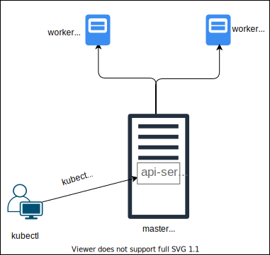

# PROJECT OF CI/CD WITH KUBERNETES  #
1. [Introduction](#Introduction)
2. [Deploy](#Deploy)
3. [Usage](#Usage)
4. [Load balancer](#Load_balancer)
5. [Network](#Network) 
6. [Hight availability configuration](#Hight_availability_configuration)
7. [Exposure of services to the outside](#Exposure_of_services_to_the_outside)

7. [CI/CD](#CI/CD)

## 1. Introduction  <a name="Introduction"></a>
----------------------------------------------


## 2. Deploy  <a name="Deploy"></a>
----------------------------------------------

The nodes deploy was done with kubespray.

  

Since kubespray uses ansible for the deployment, you must use a linux shell (a linux server or the wsl windows console) to complete the operation.

The steps to perform the operation are detailed below:
* step 1

    - Donwload the last version of kubespray:

        ``` git clone https://github.com/kubernetes-sigs/kubespray.git ```

* step 2 
    - The commands below must be execute on all nodes, workers and master:

        ```modprobe br_netfilter ```

        ``` echo '1' > /proc/sys/net/bridge/bridge-nf-call-iptables ```

        ``` sysctl -w net.ipv4.ip_forward=1 ```

        ``` systemctl stop firewalld ```
* step 3
    - Place the public key in the authorized_keys file of all the nodes that will integrate the cluster, both the master and the worker nodes, in order to be able to authenticate via ssh without using a password.


* step 4
    - Install python and pip on the server or in the wsl from where you want to run ansible.

* step 5
    - Install dependencies and configure optional variables in kubespray.

        ``` cd kubespray ```

        ``` sudo pip install -r requirements.txt ```

        ``` cp -rfp inventory/sample inventory/mycluster ```

    - Make a copy of the inventory.ini file and edit it so that it contains the number of master and worker nodes that we want to deploy and their respective names. A copy of the one used for this test scenario is left (hosts.ini)

    - Optional: you can configure some optional parameters such as the network agent (kubespray / inventory / mycluster / k8s-cluster.yml) or some add-on (kubespray / inventory / mycluster / addons.yml)

* step 6
    -Perform deployment:

    ``` ansible-playbook -i inventory/mycluster/hosts.ini cluster.yml ```

    Note: this process, depending on the number of nodes and the parameters set, may take up to 20 minutes to complete.

Some operations that can be performed with the finished cluster: 

- To add a node to the cluster, add a line in the [all] and [kube-node] section with the node that you want to incorporate and execute the following command:

     ```  ansible-playbook -i inventory/mycluster/hosts.ini remove-node.yml ```

- To remove a node from the cluster, keep the [all] section and leave only the node that you want to remove in the [kube-node] section and then execute the following command:

    ```  ansible-playbook -i inventory/mycluster/hosts.ini scale.yml ```
 
- With the updated hosts.ini file run the file:

    ```ansible-playbook -i inventory/mycluster/hosts.ini reset.yml ```


## 3. Usage  <a name="Usage"></a>
----------------------------------------------

Once the cluster is created, you can send commands to the api-server on the master node, using the kubectl command client, for which you need to authenticate to it and set some parameters contained in the config file.

The kubectl can be installed on both linux and windows. It is worth mentioning that it will be installed by default on the master node.

After installing kubectl use the config file located in /root/.kube/ on the master node and overwrite the one that is already present in the path C: \ Users \ <user> \ .kube \ in windows or /root/.kube / on linux.

With all these steps completed we are able to access the cluster and execute commands.



Note: the config file is available in this repository.

Open de console cmd of windows or Linux terminal start the belows commands to show some cluster things:


Show version of client and server:

```kubectl version ```

Command to see all pods running in the cluster:

```kubectl get pods ```


## Example of exposed service by load balancer ##

```kubectl run nginx --image nginx```

```kubectl expose deploy nginx --port 80 --type LoadBalancer```


## 4. Load balancer  <a name="Load_balancer"></a>
---------------------------------------------------------------
The load balancer allows to expose services outside the cluster, using an external, public or private IP.

In our case, its implementation will consist of the installation of the Metal Load Balancer module.

[Metal Load Balancer ](https://github.com/ifridemberg/CICD-k8s/tree/master/MetalLB/Readme.md)


## 5. Network<a name="Network"></a>
------------------------------------------------------------------------------------

This is the network scheme and IP addressing that allows access to the cluster from outside it.

In this scheme, two network segments necessary to work with the cluster are developed, as can be seen in the following figure.


The development range will be used as an address when the deployment of development projects is needed. Since the Metal Load Balancer does not support the dhcp relay, it will be the final manager of the addressing, which will assign IP to the different services that are deployed using the range 10.140.0.0 consecutively ascending starting from 10.140.0.1 until reaching 10,140,254,254. The reason a non-existent range is used in the current network is to avoid possible overlaps.

The production range will be used for development projects that are already in the production phase, and that therefore their access requires public IP. The reason why a different network is used (190.114.206.240/28) is to avoid having two equal ranks in different segments.

| Network                | Purpose       | IP Range                          |
| :----:                 | :----:        | :----:                            |
| 10.140.0.0/16          | Desarrollo    | 10.140.0.1 – 10.140.254.254       |
| 190.114.206.240/28     | Produccion    | 190.114.206.241 – 190.114.206.254 | 


## 6. Hight availability configuration <a name="Hight_availability_configuration"></a>
----------------------------------------------------------------------------------------

The high availability configuration requires the use of an etcd (key / value service) cluster configuration of at least 3 nodes.
As can be seen in the figure below, each master node contains an etcd service, so that if one goes out of service the cluster can still be accessed, and it will remain in operation using one of the other two nodes.


In the case of worker nodes, these are the ones that provide horizontal scalability, so their number is not vital for the HA, but the deployment.

## 7. Exposure of services to the outside <a name="Exposure_of_services_to_the_outside"></a>
------------------------------------------------------------------------------------------------------------------------
The following scheme provides a basic view of how the cluster is managed to be used by the different projects, in addition to a basic scheme of exposing the different services.


The cluster will be divided into namespaces which will be assigned one for each project. In the same namespace, the different resources and necessary users can be assigned, such as addresses for that namespace, CPU, memory, etc.


## 8. CI/CD <a name="CI/CD"></a>
---------------------------------------------------------------------------------

The following diagram shows the basic operation of the pipeline


