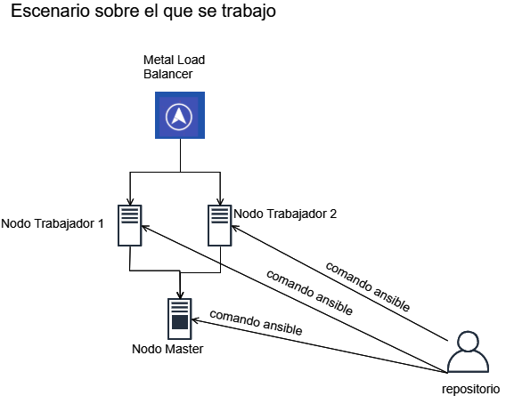
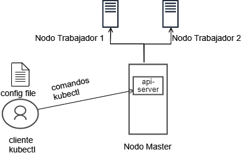

# PROYECTO KUBERNETES UTN #
1. [Despliegue](#Despliegue)
2. [Uso](#Uso)
3. [Balanceador de Carga](#Balanceador_de_Carga)
4. [Esquema de Red y Direccionamiento IP](#Esquema_de_Red_y_Direccionamiento_IP) 
5. [Configuracion alta disponibilidad](#Configuracion_alta_disponibilidad)
6. [Esquema de la exposicion hacia afuera del cluster](#Esquema_de_la_exposicion_hacia_afuera_del_cluster)
7. [Autenticacion de usuarios](#Autenticacion_de_usuarios)
8. [Diagrama basico de CI/CD](#Diagrama_basico_de_CI/CD)


## 1. Despliegue  <a name="Despliegue"></a>
----------------------------------------------

El despliegue de los nodos se realizo usando kubespray.

  

Dado que kubespray usa ansible para el despliegue se debera usar algun shell de linux(un servidor linux o la consola para windows wsl)  para completar la operacion.

A continuacion se detallan los pasos para realizar la operacion:

* Paso 1

    - Descargar la ultima version de kubespray usando el comando git clone:

        ``` git clone https://github.com/kubernetes-sigs/kubespray.git ```

* Paso 2 
    - Ejecutar los sgtes comandos en todos los futuros nodos tanto master como trabajadores:

        ```modprobe br_netfilter ```

        ``` echo '1' > /proc/sys/net/bridge/bridge-nf-call-iptables ```

        ``` sysctl -w net.ipv4.ip_forward=1 ```

        ``` systemctl stop firewalld ```
* Paso 3
    - Colocar la llave publica en el archivo authorized_keys de todos los nodos que van a integrar el cluster, tanto el master como los nodos trabadores, de manera de poder authenticarse via ssh sin usar contraseña.


* Paso 4
    - Installar python y pip en el servidor o en el  wsl desde donde se quiera ejecutar ansible.

* Paso 5
    - Instalar dependencias y configurar variables opcionales en kubespray.

        ``` cd kubespray ```

        ``` sudo pip install -r requirements.txt ```

        ``` cp -rfp inventory/sample inventory/mycluster ```

    - Hacer una copia del archivo inventory.ini y editarlo para que contenga la cantidad de nodos master y trabajadores que deseamos desplegar y sus respectivos nombres. Se deja una copia del que se uso para este escenario de prueba (hosts.ini)

    - Opcional: se puede configurar algunas parametros opcionales  como el agente de red (kubespray/inventory/mycluster/k8s-cluster.yml) o algun agregado (kubespray/inventory/mycluster/addons.yml)

* Paso 6
    -Realizar despliegue:

    ``` ansible-playbook -i inventory/mycluster/hosts.ini cluster.yml ```

    Nota: este proceso dependiendo de la cantidad de nodos y de los parametros seteados puede tener una demora de hasta 20 minutos para que se complete.

Algunas operaciones que se pueden realizar con el cluster finalizado: 

- Para  agregar un nodo al cluster, agregar una linea en la seccion [all]  y [kube-node] con el nodo que se quiere incorporar y ejecutar el sgte comando:

     ```  ansible-playbook -i inventory/mycluster/hosts.ini remove-node.yml ```

- Para sacar un nodo del cluster mantener la seccion [all]  y dejar solo el nodo que se quiere remover en la seccion [kube-node] y luego ejecutar el sgte comando: 

    ```  ansible-playbook -i inventory/mycluster/hosts.ini scale.yml ```
 
- Con el archivo hosts.ini  actualizado ejecutar el archivo:

    ```ansible-playbook -i inventory/mycluster/hosts.ini reset.yml ```


## 2. Uso  <a name="Uso"></a>
----------------------------------------------

Una vez creado el cluster, se podra enviar comandos a la api-server en el nodo master, usando el cliente de comandos kubectl, para lo cual se necesita autenticarse al mismo y setear algunos parametros contenidos en el archivo config.

El kubectl se podra instalar tanto sobre  linux como windows. Cabe mencionar que estara instalado por defecto en el nodo master.

Despues de instalar kubectl usar el archivo config ubicado en /root/.kube/ en el nodo master  y sobreescribir el que ya esta presente en la ruta C:\Users\<user>\.kube\  en windows  o /root/.kube/  en linux. 

Con todos estos pasos ya completados  estamos en condiciones de acceder al cluster y ejecutar comandos.



Nota: el archivo config esta disponible en este repositorio.


Debemos abrir una consola de cmd en windows o terminal en linux y empezar ejecutar comandos:

Comando para ver la version tanto del cliente como el servidor:

```kubectl version ```

Comando para ver los pods que se estan ejecutando actualmente en el cluster:

```kubectl get pods ```


## Ejemplo de servicio expuesto con el  tipo Load Balancer##

```kubectl run nginx --image nginx```

```kubectl expose deploy nginx --port 80 --type LoadBalancer```


## 3. Balanceador de Carga  <a name="Balanceador_de_Carga"></a>
---------------------------------------------------------------
El balanceador de carga permite exponer servicios hacia afuera del cluster, usando una ip  externa.

En nuestro caso la implementacion del mismo constara de la instalacion del modulo Metal Load Balancer.


[Metal Load Balancer ](http://gitlab/cc/kubernet/blob/master/MetalLB/Readme.md)


## 4. Esquema de Red y Direccionamiento IP <a name="Esquema_de_Red_y_Direccionamiento_IP"></a>
------------------------------------------------------------------------------------

Este es sera el esquema de red y direccionamiento IP que permita acceder al cluster desde el exterior al mismo.
En este esquema se desarrollan dos segmentos de red necesarios para el trabajo con el cluster, como se puede ver en la figura siguiente.


El rango desarrollo sera usado como direccionamiento cuando se necesite el despliegue de proyectos de desarrollo. Dado que el Metal Load Balancer no soporta el dhcp relay, el mismo sera el encargado final del direccionamiento, el cual asignara IP  a los distintos servicios que se desplieguen usando el rango 10.140.0.0 en forma consecutiva ascendente empezando desde 10.140.0.1 hasta llegar a 10.140.254.254. El motivo por el que se usa un rango no existente en la red actual es para evitar los posibles solapamientos.

EL rango produccion, sera usado para los proyectos de desarrollo que ya se encuentren en la fase de produccion,, y que por lo tanto su acceso requiera IP publica. EL motivo por el que se usa una red distinta (190.114.206.240/28) es para evitar tener dos rango iguales en distintos segmentos.

| Red                    | Proposito     | Rango                             |
| :----:                 | :----:        | :----:                            |
| 10.140.0.0/16          | Desarrollo    | 10.140.0.1 – 10.140.254.254       |
| 190.114.206.240/28     | Produccion    | 190.114.206.241 – 190.114.206.254 | 


## 5. Configuracion alta disponibilidad <a name="Configuracion_alta_disponibilidad"></a>
----------------------------------------------------------------------------------------

La configuracion de alta disponibilidad requiere el uso la configuracion de un cluster de etcd (servicio clave /valor) de al menos 3 nodos. 
Como se puede ver en la figura sgte cada nodo master contiene un servicio etcd, de manera que si alguno sale de servicio el cluster aun podra ser accedido, y se mantendra en funcionamiento usando alguno de los otros dos nodos.


En el caso de los nodos worker, estos son los que proveen la escalabilidad horizontal, de manera que su numero no es vital para la HA, pero si el despliegue.

## 6. Esquema de la exposicion hacia afuera del cluster <a name="Esquema_de_la_exposicion_hacia_afuera_del_cluster"></a>
------------------------------------------------------------------------------------------------------------------------
El esquema siguiente provee una vista basica de como se administra el cluster para ser usado por los diferentes proyectos, ademas de un esquema basico de exposicion de los distintos servicios.


El cluster se dividira en namespace los cuales se asignaran un por cada proyecto. En el mismo namespace se podra asignar los diferentes recursos y usuarios necesarios, como direcciones para ese namespace, CPU, memoria, etc.

## 7. Autenticacion de usuarios <a name="Autenticacion_de_usuarios"></a>
-------------------------------------------------------------------------------


## 8. Diagrama basico de CI/CD <a name="Diagrama_basico_de_CI/CD"></a>
---------------------------------------------------------------------------------

El esquema siguiente muestra el funcionamiento basico del pipeline 


